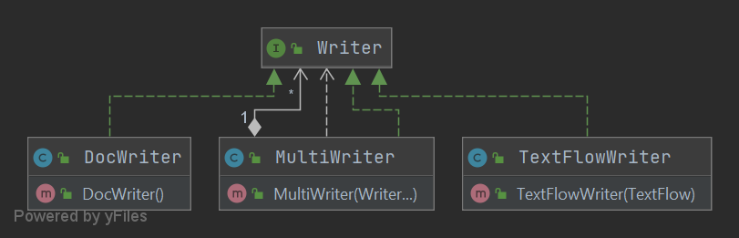
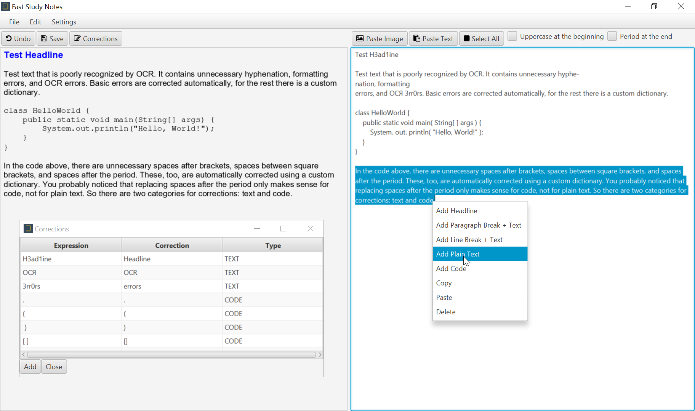

<a name="readme"/>

# 

**Fast Study Notes** is a cross-platform GUI note-taking application written in
Java/JavaFX that provides convenient tools for taking notes from fragments of
digital study materials or documentation. The main feature of the application is
easy work with scans of textbooks with poorly recognized text via OCR. When
copying material from such textbooks, there is no need to constantly correct
recognition mistakes, which can often be duplicated for the same character
combination, since the application allows to automatically correct such mistakes
using an extensible dictionary. The application has a simple architecture that
allows for easy expansion of supported document formats and a functional user
interface that is optimized to perform the required tasks. During the
development process special attention was paid to the simplicity and readability
of the code, as well as the ease of support. The project is covered by unit
tests and documented.

## Table of Contents

[How it works](#how-it-works)  
[Features](#features)  
[Architecture](#architecture)  
[Code style](#style)  
[Getting started](#getting-started)  
[User manual](#manual)  
[TODO](#todo)  
[License](#license)  
[Contribution](#contribution)

<a name="how-it-works"/>

## How it works

- [OpenJFX](https://openjfx.io) for user interface implementation;
- [Java2word](https://github.com/leonardoanalista/java2word) to implement saving
  of MS Word documents;
- [Font Awesome](https://bitbucket.org/Jerady/fontawesomefx) for icons;
- [Lombok](https://projectlombok.org) to avoid boilerplate code;
- [JUnit](https://junit.org/junit5/) for writing unit/integration tests;
- [Mockito](https://site.mockito.org) for creating a mock objects in
  unit/integration tests;
- [EqualsVerifier](https://jqno.nl/equalsverifier/) to test the `equals()`
  and `hashCode()` methods.

Maven is used to automatically build the project.   
sqlite is used as a database.

<a name="features"/>

## Features

- A functional user interface, which alerts the user about errors, warns about
  the possible irreversibility of operations, and informs about the successful
  completion of actions, the result of which is not obvious;
- Saving documents in the MS Word format;
- Users can quickly add and format document elements (headings, plain text,
  code, images) in a couple of clicks;
- Added text is automatically corrected from frequent OCR text recognition
  errors; there is a custom user dictionary for advanced correction rules;
- An option to add plain text, which does not go through the correction and
  formatting procedures;
- Additional features that simplify the correction of copied text fragments:
  for example, the application can automatically put a period at the end of the
  sentence of the added fragment or start a new sentence with a capital letter;
- Custom dictionary entries are divided into two types: for text correction and
  code correction, because some character combinations can be obviously
  incorrect for the code (e.g. space after dots) but normal for the text and
  vice versa;
- Keyboard shortcuts.

<a name="architecture"/>

## Architecture


<sup>A Writer implementations relationship diagram</sup>

- A clean package structure, with classes organized by purpose, area of
  responsibility, and level of abstraction;
- Following the principles of separation of concerns and loose coupling;
- A focus on generally accepted good coding principles and design patterns;
- Following encapsulation principles to provide convenient and secure
  interfaces;
- Document elements are both added and displayed through the objects of Writer
  interface, allowed to make these operations uniform. All operations are
  executed on a MultiWriter object, which can contain an unlimited number of
  Writer objects and delegate the execution of interface methods to them, so
  it's possible to easily implement other views and saving formats.

<a name="style"/>

## Code style

- Focus to write simple and readable code;
- Simple and meaningful names of classes, methods and variables, separation of
  different aspects of functionality in separate methods;
- The code is accompanied by documentation, with complex points accompanied by
  comments;
- Division of complex code constructs into several primitive parts for better
  understanding;
- Limiting the number of characters by line width for better readability;
- Diverse operations are separated by indents;
- Avoiding "spaghetti code" (nested ifs);
- Using Lombok to avoid boilerplate code.

<a name="getting-started"/>

## Getting started

Java 11 or above is required.

### Run

```bash
mvnw clean javafx:run
```

### Build

```bash
mvnw clean package
```

File should be created at: target\fast-study-notes-1.0-SNAPSHOT.jar

### Run tests

```bash
mvnw clean test
``` 

<a name="manual"/>

## User manual



### Basics

The main working area is located in the right text box. It is supposed that the
user will copy the text there and then work with it directly, selecting the
fragments to be added to the document and selecting the type of element with the
context menu. It is also possible to set via checkboxes that the selected
fragment should always start with a capital letter, and/or that it should always
end with a period (if no other punctuation marks are present). When an element
is added via the context menu, a preview of the document is shown on the left
side of the window.

### Standard processing of the added text

#### Normal text

1. All line breaks in the text are replaced with spaces. This is done because
   the poorly recognized text has a break after each line, which is relevant
   only to the original line size and formatting.
2. All "soft hyphen" characters (characters that move the word to the next line)
   are removed.
3. All double spaces are removed.
4. Hyphens are removed if they are used to transfer lines.
5. Custom dictionary corrections are applied to the text.

#### Code

1. All spaces at the end of the text are removed.
2. Custom dictionary corrections are applied to the text.

### Context menu options

#### Add Headline

Adds the selected text to the document as a headline. The text passes the
standard processing mentioned above.

#### Add Paragraph Break + Text

Adds a paragraph break to the document and after it adds the selected text. The
text passes the standard processing specified above. Paragraph break adding has
been combined with adding of normal text for the reason that poorly recognized
text loses paragraph data and can create unnecessary line and paragraph breaks
that should be ignored. And combining paragraph break adding with adding of
normal text makes the process of restoring paragraphs or marking indents between
the text a more convenient process.

#### Add Line Break + Text

Adds a line break to the document and after it adds the selected text. The text
passes through the standard processing mentioned above. Line break adding has
been combined with adding of normal text for the same reason as mentioned in
"Add Paragraph Break + Text".

#### Add Code + Text

Adds monospaced text to the document. The text passes through the standard
processing specified above.

#### Add Plain Text

Adds unformatted text to the document that doesn't pass through any processing.

### Adding Images

The "Paste Image" button is used to paste an image from the clipboard.

### Undo changes

The addition of an element can be canceled by using the "Undo" button.

### Saving the document

The document can be saved using the "Save" button. The document can be saved to
another folder by selecting "File - Save As".

### Open the last saved file

The last saved file can be opened by selecting "File - Last Saved File".

### Custom dictionary

The entries in the custom dictionary can be customized using the "Corrections"
button.

#### Adding new corrections

Corrections can be added using the "Add" button.

#### Editing or removing existing corrections

The existing corrections can be edited or removed using the context menu.

<a name="todo"/>

## TODO

- [ ] Write integration tests for components for which unit testing is
  impossible (JavaFX controllers and `SimpleAlertCreator`).
- [ ] Implement automatic code formatting for different programming languages.
- [ ] Add mnemonics.

<a name="license"/>

## License

Copyright ©2022 Artyom Mameev.  
Licensed under the [MIT License](https://opensource.org/licenses/MIT).

[Java2word](https://github.com/leonardoanalista/java2word)
is licensed under the
[MIT License](https://opensource.org/licenses/MIT).

<a name="contribution"/>

## Contribution

Any contributions to the project are welcome.
